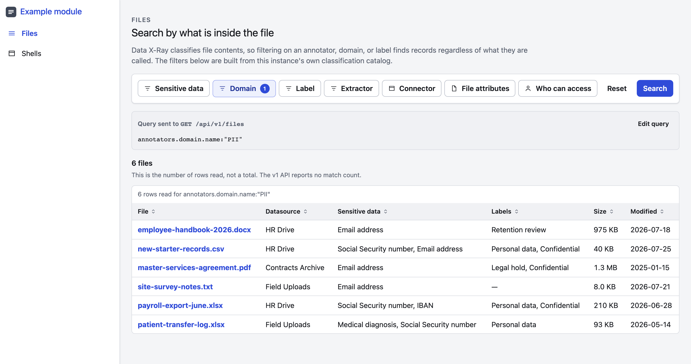

# Data X-Ray frontend starter kit

A security-first React starter for applications built on the
[Data X-Ray public API](docs/dxr-public-api.md). It ships a working example — a
filter UI that searches files by what is *inside* them — and the hardening you
would otherwise have to assemble yourself.

Three runtime dependencies: `react`, `react-dom`, and nothing else. Everything
resolves from the public npm registry, so there is no credential to obtain before
you can install.



## Start here

```sh
npm ci --ignore-scripts
npm run dev
```

Open <http://127.0.0.1:4173>. That's it — **no API token required**. With no
credentials configured, the development proxy serves the synthetic corpus in
`fixtures/`, so the whole application works offline.

### Against your sandbox

You should have been issued a Data X-Ray sandbox URL and a personal access
token. Put them in `.env`:

```sh
cp .env.example .env
# edit .env: set DXR_API_URL and DXR_API_TOKEN
npm run dev
```

The dev server prints which mode it started in. `.env` is gitignored — the token
is a real, broadly privileged credential, so treat it like a password and never
commit it.

If no sandbox has reached you yet, everything below still works in fixture mode.
Ask your Ohalo contact for an instance and a token; you can generate the token
yourself from your Data X-Ray profile's API settings once you have access.

The token stays server-side and is never bundled. Read
[API authentication](docs/api-authentication.md) before deploying anything — the
browser must never hold that credential, and the dev proxy is **not** a
production backend.

## What the example does

The Files page loads the instance's classification catalog and builds its filters
from it. That is the point: Data X-Ray classifies file **contents**, so searching
for an annotator (`Credit card`), a domain (`PII`), or a label (`Legal hold`)
finds records regardless of what they are named. A filename search would miss
`Staff_Records.xlsx`.

It also shows the query it compiles, so the relationship between the controls and
the request is visible rather than magic, and offers a hand-written query escape
hatch validated against the same rules.

Three properties of the v1 API shape the whole design, and the UI states each one
plainly rather than hiding it:

- **No total count.** The row count is labelled "rows read", never a total.
- **No pagination.** The client streams and stops at a row cap, and says so.
- **Broad queries truncate mid-stream.** A truncated result raises a persistent
  warning; presenting it as complete would be a correctness bug.

Search with no filters selected to see all three.

## What you get

- **`src/ui`** — your own primitives: button, checkbox, text and search inputs,
  select, dropdown, panel, notice, tabs, loading bar, and a semantic sortable
  table. Semantic HTML, keyboard operable, visible focus.
- **`src/styles/tokens.css`** — the entire theming contract. Light and dark, keyed
  off the OS preference with no flash of the wrong scheme. A rebrand is this one
  file.
- **`src/dxr`** — hand-written API types, a query compiler that encodes each
  grammar rule the server enforces, a streaming JSONL reader with a hard cap and
  cancellation, and catalog loading.
- **`src/config/runtimeConfig.ts`** — public configuration fetched with redirects
  denied, bounded to 16 KiB, validated against a closed schema, failing closed to
  a generic error page before React mounts.
- **Strict CSP** in both the dev server and the production nginx config:
  `default-src 'none'`, no inline script or style in the build, no third-party
  origins. The icon set is inline SVG and the font stack is the system stack so
  the policy needs no exceptions.
- **Supply-chain gates** — exact versions, committed lockfile, SHA-512 integrity,
  single-registry enforcement, install scripts denied, a release-age window, a
  license policy, and secret and configuration scanning.
- **Tests** — 77 unit tests and 9 browser tests, including a test per query
  grammar rule and coverage of cap-and-abort, chunk-boundary reassembly,
  interrupted streams, and error mapping.
- **A digest-pinned, non-root, shell-free nginx runtime** with strict headers.
- **`server/dxrProxy.mjs`** — the development proxy and fixture mode, in Node
  built-ins with zero dependencies.

## Commands

| Command | Does |
| --- | --- |
| `npm run dev` | Development server, fixture mode unless a token is set |
| `npm run check` | Toolchain, format, typecheck, unit tests, production build |
| `npm test` | Unit tests |
| `npm run test:e2e` | Build, then browser tests |
| `make security` | Lockfile, licenses, audit, secrets, workflow, config scans |
| `make release-gate` | Everything, including image build and image scan |

`make ci` and `make security` are the two gates to run before calling a change
done.

## Making it yours

Delete first. The Shells page is a gallery, the Files page is an example, and the
fixtures are synthetic — none of it is load-bearing.

1. Replace `public/config.json`, `public/favicon.svg`, and `index.html`'s title.
2. Set your palette and type in `src/styles/tokens.css`.
3. Delete `src/app/ShellsPage.tsx` and the shells you do not use from
   `src/components/navigation/NavigationShells.tsx`. No shell at all is a valid
   answer for a focused tool.
4. Rewrite `src/app/FilesPage.tsx` for your workflow, keeping the shape: one
   explicit query model, bounded work, cancellation on every new search, and a
   distinct state for every outcome.
5. Write the production backend described in
   [API authentication](docs/api-authentication.md).

[Adopting the starter](docs/adopting.md) has the decision rubric. Read
[the API contract](docs/dxr-public-api.md) before extending `src/dxr` — the
endpoint set is small and fixed, and its limits are constraints to design around
rather than bugs to route around.

## Documentation

| Document | Covers |
| --- | --- |
| [The public API](docs/dxr-public-api.md) | Endpoints, query grammar, truncation, response shapes |
| [API authentication](docs/api-authentication.md) | Why the browser cannot hold the token, and what to build instead |
| [Architecture](docs/architecture.md) | Layers, dependency direction, what is deliberately absent |
| [Adopting the starter](docs/adopting.md) | Decisions to record, and the adoption rubric |
| [Component reference](docs/component-library.md) | `src/ui` primitives and the reference compositions |
| [Runtime configuration](docs/runtime-configuration.md) | `config.json` schema and validation |
| [Product identity](docs/branding.md) | Naming, logos, and the same-origin asset rule |
| [Deployment](docs/deployment.md) | Image build, release evidence, serving |
| [Threat model](docs/security/threat-model.md) | Assets, boundaries, and mitigations |
| [Supply chain](docs/security/supply-chain.md) | Dependency policy and the gates that enforce it |

`AGENTS.md` and `.agents/skills/app-builder/` carry the same rules in the form
coding agents read.

## Requirements

Node 24.15.0 and npm 12.0.1, both pinned exactly and verified by
`npm run verify:toolchain`. `scripts/bootstrap-npm.sh` installs the pinned npm
from an integrity-checked tarball if you need it.

## Contributing

Pull requests are welcome — see [CONTRIBUTING.md](CONTRIBUTING.md). `main`
requires a passing CI run and an approving review from the Ohalo FDE team.

Report a security issue privately to **security@ohalo.co**, never through an
issue or a pull request. See [SECURITY.md](SECURITY.md).

## License

MIT — see [LICENSE](LICENSE).

That covers this starter kit only. Data X-Ray, its API, and its specification are
proprietary to Ohalo Ltd. and licensed separately; access to an instance and an
API credential come under a separate agreement. See [NOTICE](NOTICE).
